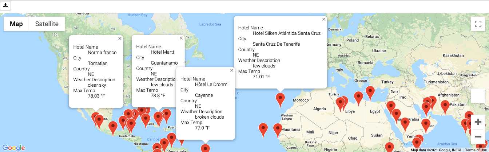
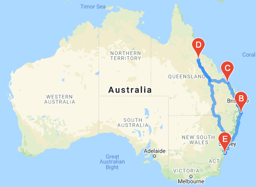
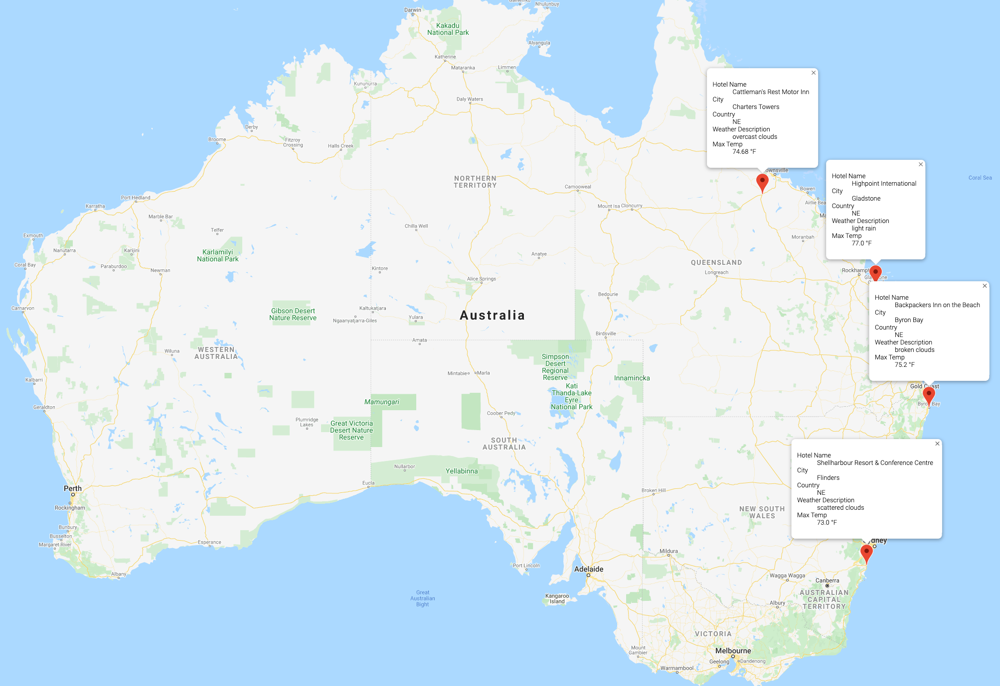

# World_Weather_Analysis

## Overview

The World Weather Analysis looks at global weather patterns and offers insights to travelers who want to book a trip. We created three folders that offer different levels of analysis: weather database, vacation search, and vacation itinerary.

## Weather Database

For our Weather Database we used the Open Weather Map API to pull weather information on 772 different cities around the world. That information consists of:
- Maximum Temperature
- Cloudiness
- Wind Speed
- Humidity
- Current Weather Description

## Vacation Search

For our vacation search we used the weather database and Google Maps API to plot different travel destinations with a hotel at each location. In our beta test example, we had the client choose a desired minimum temperature (70 Degrees F) and maximum temperature (80 degrees F) and plot all the locations that met the criteria.

## Vacation Itinerary

For our vacation itinerary we used the Google Maps directions API. In our beta test example, we created a hotel itinerary in eastern Australia that featured four stops starting in Flinders (outside Sydney) and made stops at Byron Bay, Gladstone and Charters Tower before returning back to Flinders.

